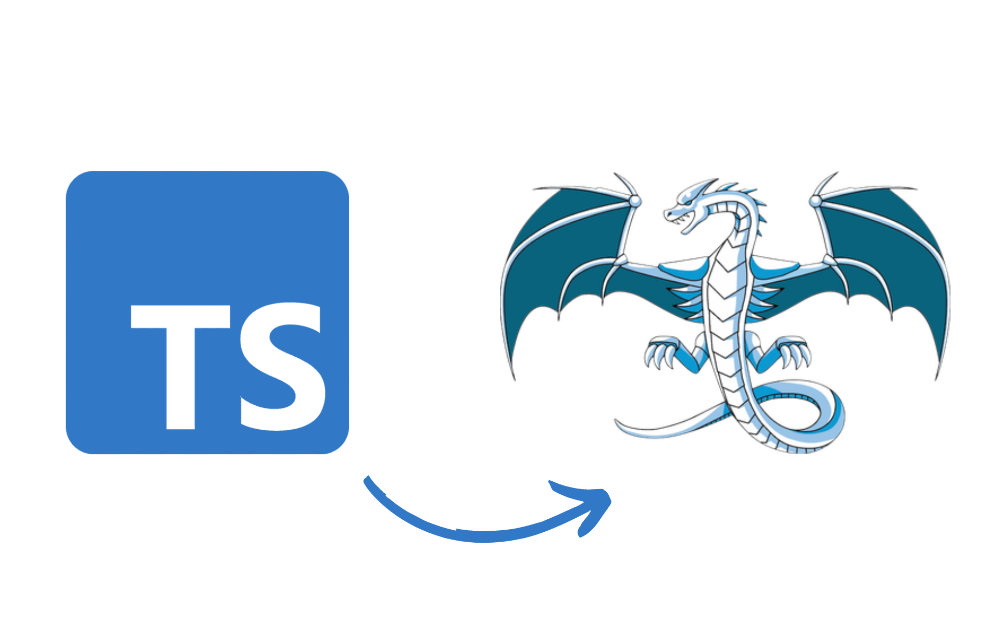

# ts-ir

<p align="center">
    
</p>

LLVM IR code generator completely from scratch, no need for external dependencies, use of ffi and other things.

## Example

Run the following commands

```bash
deno run examples/example.ts >> test.ll
```

The IR generated

```llvm
declare i32 @printf(i8*, ...)

@.str0 = private constant [12 x i8] c"Result: %d\00"

define i32 @main() {
entry:
  %t0 = alloca i32, align 4
  %t1 = alloca i32, align 4
  store i32 10, i32* %t0, align 4
  store i32 20, i32* %t1, align 4
  %t2 = load i32, i32* %t0, align 4
  %t3 = load i32, i32* %t1, align 4
  %t4 = add i32 %t2, %t3
  %t5 = getelementptr inbounds [12 x i8], [12 x i8]* @.str0, i32 0, i32 0
  %t6 = call i32 @printf(i8* %t5, i32 %t4)
  ret i32 %t4
}
```

Compile and run

```bash
clang test.ll -o test; ./test
```

Output

```bash
Result: 30
```
